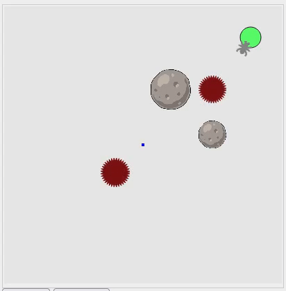

# Swarm

A simple swarm simulator to simulate collective behaviors using grammatical evolution and Behavior Trees. Users can use the exisiting primitive behaviors or can define new behaviors with ease and see collective behaviors either manually building behavior tree or let grammatical evolution do the trick to evolve collective behaviors. This project is based on mesa framework. Brief feature list:
* Notable primitive behaviors already coded
* Easy to use and visualize
* Uses behaviors trees
* Grammatical evolution for evolving collective behaviors



## Getting Started

These instructions will get you a copy of the project up and running on your local machine for development and testing purposes. See deployment for notes on how to deploy the project on a live system.

### Prerequisites

What things you need to install the software and how to install them

```
pip install matplotlib numpy scipy scikit-learn pandas psycopg2-binary==2.8.6
```

### Installing

This swarm framework depends on PonyGE2 for grammatical evolution and py_trees for Behavior trees. You need to clone these framework from below location

PonyGE2

```
git clone https://github.com/aadeshnpn/PonyGE2
cd PonyGE2
pip install .
```

FLLOAT

```
git clone https://github.com/whitemech/flloat.git
cd flloat
pip install .
```

And for py_trees

```
git clone https://github.com/splintered-reality/py_trees.git
cd py_trees
pip install .
```


Now all the dependencies are installed

clone the swarm repo
```
git clone --recursive https://github.com/aadeshnpn/swarm
cd swarm
pip install .
```
Now you have the swarm framework installed.

## Running the tests

All the tests files are located under test folder. Just traverse to the folder and run
```
nosetest test_swarm_behaviors.py
```
to test is the swarms related modules are working or not. But there are lots of
test files to test other modules

## Contributing

Just submit the pull requests to us. The code should be properly formatted and validated using all PEP8 rules and flask rules excluding ignore=F403,E501,E123,E128.  If you are using visual studio code you can add following to your setting files
```
"python.linting.flake8Enabled": true,
"python.linting.flake8Args": ["--ignore=F403,E501,E123,E128","--exclude=docs,build"]
```


## Experiment
There is an examples folder. You can see cool experiments done with swarms. If you want to add
new experiment. Follow the structure of the experiments under example folder.
The main scripts for a good experiment is agent.py, model.py and run.py
agent.py contains the description for the agents.
model.py contains the description for the environment.
run.py contains the experiment to run along with UI module exposure. Got to the experiment folder you want to run and then execute it using
```
./viewer
```

### UI
Just run node server.js from ui/viewer folder to run the experiments and view the results in browser.
Then open your favourite browser and go to
```
localhost:3000
```

## Authors

* **Aadesh Neupane** - *Initial work* - [Aadeshnpn](https://github.com/aadeshnpn)

See also the list of [contributors](https://github.com/aadeshnpn/swarm/contributors) who participated in this project.

## License

This project is licensed under the MIT License - see the [LICENSE.md](LICENSE.md) file for details

## Acknowledgments

* Mesa team
